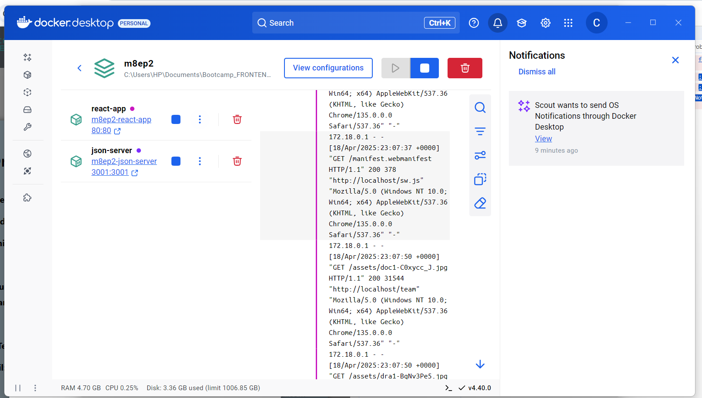
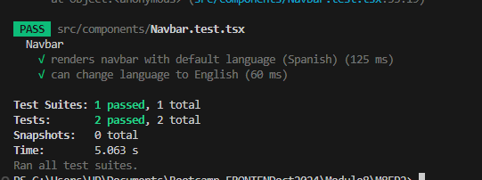

# M8EP2 Implementación de Docker,Testing y CI/CD en el Proyecto Final

**Contexto:**
Aplicar los conceptos de DevOps en el proyecto desarrollado a lo largo de la especialización, sitio web de un Centro Mèdico.
- Integrar Docker para la ejecución del proyecto, implementar pruebas automatizadas en al menos un componente, configurar un
pipeline de CI/CD con GitHub Actions y gestionar ramas en la nube para mantener un flujo de
desarrollo ordenado.
___________________________________________________________________________

#  Levantar el proyecto  🚀
 Ejecuta los siguientes comandos en tu terminal:

1. **`json-server --watch db.json --port 3001`**  
   - Inicia un servidor JSON falso que simula una API REST utilizando el archivo `db.json`.
   - La opción `--watch` permite que se actualice automáticamente cuando `db.json` cambia.
   - `--port 3001` especifica que se ejecutará en el puerto 3001.

   - JSON Server started on PORT :3001
Press CTRL-C to stop
Watching db.json...

( ˶ˆ ᗜ ˆ˵ )

Index:
http://localhost:3001/

Static files:
Serving ./public directory if it exists

Endpoints:
http://localhost:3001/doctors
http://localhost:3001/appointments
http://localhost:3001/users

2. **`node server.js`**  
   - Ejecuta un archivo `server.js` con Node.js.
   - Servidor escuchando en el puerto 3000

3. **`npm run dev`**  
   - Ejecuta el script `dev` que está definido en el archivo `package.json` dentro del proyecto.
   - Este comando inicia el entorno de desarrollo 

   -   VITE v6.0.3  ready in 1329 ms

  ➜  Local:   http://localhost:5173/
  ➜  Network: use --host to expose
  ➜  press h + enter to show help

4. **URL sitio:**
 http://localhost:5173/
 
 
 
 
# USUARIOS PARA LOGIN
Puedes usar cualquiera de estos usuarios para iniciar sesión.

✅ username: usuario1

password: password1

name: Usuario Test
_______________________

✅ username: admin

password: password2

name: Administrador

__________________________________________________

## Requerimiento:
Integración de Docker en el Proyecto 
- Crear un Dockerfile funcional para el proyecto.

- Configurar docker-compose.yml si el proyecto requiere múltiples servicios.

- Asegurar que el contenedor se ejecute correctamente y facilite la portabilidad del
proyecto.

### Ajustes realizados:

Se crearon estos tres archivos en la raíz del proyecto:
- Dockerfile (para la aplicación React)

- Dockerfile.json (para json-server)

- docker-compose.yml (para orquestar ambos servicios)

### Construir y levantar los contenedores usando el comando:
docker-compose up --build  

###  Facilitar la portabilidad del proyecto:

Al utilizar Docker y Docker Compose, el proyecto se vuelve mucho más portátil. Cualquiera que tenga Docker configurado en su entorno puede ejecutar el proyecto solo con el archivo docker-compose.yml. No es necesario que instalen manualmente todas las dependencias o configuraciones de la aplicación.
Esto significa que todos los entornos (desarrollo, producción, etc.) pueden configurarse de forma consistente.

__________________________________________________________

# Iniciar el Proyecto con Docker

docker-compose up --build

# 2. Implementación de Pruebas Automatizadas
- Crear pruebas unitarias o de integración para al menos un componente clave del
proyecto.
- Utilizar herramientas de testing apropiadas como Jest, Mocha, PyTest o JUnit.
- Asegurar que las pruebas se ejecuten correctamente y generen reportes.

# Instalación de dependencias
Abre tu terminal en el directorio raíz de tu proyecto y ejecuta el siguiente comando para instalar las dependencias necesarias:

npm install --save-dev jest @testing-library/react @testing-library/jest-dom  

En package.json. Añadir:

"scripts": {  
    "test": "jest"  
}  
 ## Agregar Archivos de Prueba
 Navbar.test.tsx  

# Ejecutar las Pruebas

npm test  

### Este test verifica el correcto funcionamiento del componente Navbar en la aplicación. Se realizan las siguientes pruebas:

#### Renderizado Inicial: 
Comprueba que el título "Centro Médico" se muestre correctamente en español cuando se carga el componente.

#### Cambio de Idioma: 
Simula un clic en el botón de cambio de idioma a inglés y verifica que el título cambie a "Medical Center".

# Configuración de CI/CD con GitHub Actions 
- Implementar un pipeline en GitHub Actions que incluya:
- Instalación de dependencias.
- Ejecución de pruebas automatizadas.
- Construcción y verificación del contenedor Docker.
- Asegurar que el pipeline se ejecute en cada push o pull request a la rama
principal.

- Se agrega el archivo ci.yml
- Se configura el pipeline en GitHub Actions para que se ejecute en cada push o pull request
- Realizar un Commit y Push:

git add .github/workflows/ci.yml  
git commit -m "Actualizar configuración de CI/CD para servir con Nginx"  
git push 

